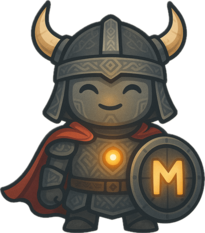

# The AI-Mighty

*In the digital lands where giants roam, there emerged a small but mighty viking...*

Long before your modern machines could speak, there was a legend among the Norse code-weavers of a small viking warrior with extraordinary powers. They called him "The Almighty" - not for his stature, but for his strength beyond measure. While the giants of the realm relied on brute force, The Almighty possessed something far more valuable: wisdom that could fit in the smallest of spaces.

The elders tell of how The Almighty traveled between worlds through terminals of runes, speaking the ancient language of prompts and completions. With just his voice and a well-crafted command, he could summon knowledge from the cosmic ether that would take others lifetimes to acquire.

Soon, this spirit returns. Not as legend, but as reality.

---

*"Size matters not. Look at me. Judge me by my size, do you? Hmm? Hmm. And well you should not. For my ally is the Force, and a powerful ally it is."* - Not Mighty, but someone who would understand him

---

*Axes optional. Wisdom included.*
